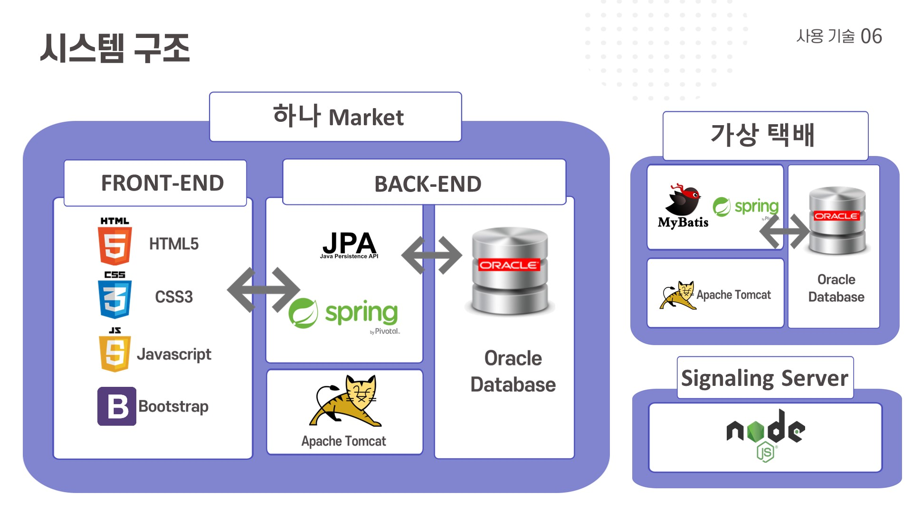

# 하나은행 손님 기반의 중고거래 플랫폼   하나Market
[프로젝트 홈페이지 - https://koposoftware.github.io/2021_15_hsjung/](https://koposoftware.github.io/2021_15_hsjung/)

# 1. 프로젝트 개요
산업간의 융복합이 가속화 되면서 업종간의 경계가 모호해 지는 빅블러 시대에 고객 기반이 갖춰진 빅테크 기업의 금융분야 진출로 기존의 금융 시장에 대한 불안감이 증폭되고 있습니다. 

이런 상황에 많은 금융권에서 디지털 금융 규제 제도가 개선됨에 따라 금융 생활 밀착형 서비스 진출을 확대하고 있습니다.

이를 토대로 현재 지속적인 성장세를 보이는 중고 거래 시장과 경매 시장에 대한 특징을 알아보고 앞으로 이러한 플랫폼 구축에 도움이 되고자 해당 프로젝트를 진행하였솝니다.

# 2. 프로젝트 제안서
##  1) 하나Market
   
   
##  2) 프로젝트 배경
   
   
# 3. 프로젝트 결과

##  1)하나Market 서비스
   
   
##  2)하나Market 응용기술
   
   
##  3)아키텍처
   
   
## 발표 ppt 
   
   [발표자료](HanaMarke_FIN.pptx) 

## 시연 동영상 

  <iframe width="560" height="315" src="https://www.youtube.com/embed/545i6T03EvU" title="YouTube video player" frameborder="0" allow="accelerometer; autoplay; clipboard-write; encrypted-media; gyroscope; picture-in-picture" allowfullscreen></iframe>
# 4. 본인 소개

본인 소개를 추가하세요

|이름 |정현석||
|연락처 | belbel94@naver.com | 
|이메일 | hyeonseogj24@gmail.com|
|skill set| Frontend - HTML, CSS, Javascript, Bootatrap|
| | Backend - Java, Spring, JPA, Mybatis, NodeJS, |
| | Database - Oracle, Mysql, MariaDB |

# 5. 기타
## 주요 기술
- WebRTC : NodeJs 웹소켓을 활용한 화상채팅 서비스
- Thumbnailator : 상품 이미지 로딩지연 해결을 위한 이미지 썸네일화
- SMS API : 구매 완료, 낙찰 정보 손님에게 전송
- Spring Scheduler : 매일 00시 낙찰된 상품 낙찰자에게 금액 전송
- AES 256 : 사용자 비밀번호 암호화

## 기대효과 및 보완점
❍기대 효과
 - 새로운 수익원 구축 
    o 중고 시장의 성장성을 바탕으로 한 새로운 수익원 창출
 - 신규 사용자 유입 
    o 플랫폼을 통한 새로운 사용자 유입
 - 생활 금융 플랫폼 구축 
    o 빅테크 기업에 대항할 수 있는 생활 금융 플랫폼 구축
 - ‘하나’ 브랜드 강화 효과 
    o 신뢰성 기반의 서비스를 통한 브랜드 강화 효과

❍보완할 점
 - 반응형 디자인 구축
 - 보안 구축
 - 영상 인식 기반 시세 파악 서비스 구축

 - 소비데이터 기반 추천 알고리즘 구축
 - 사기 대응 방안
 - 카드 무통장 입금 등 다양한 결제 시스템 구축

 
